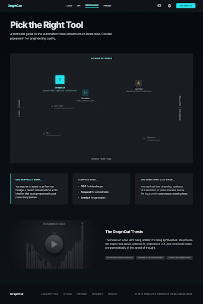
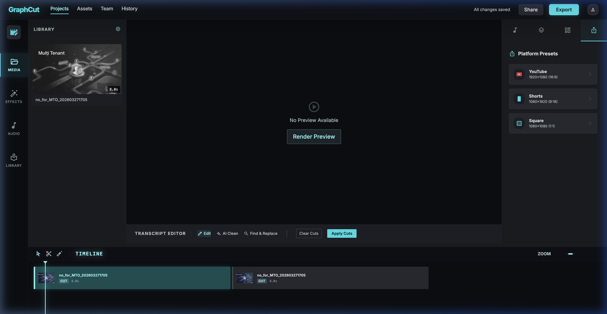
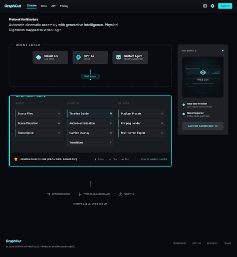

<div align="center">
  <br/>
  
  <br/><br/>

  # GraphCut 🎬✂️

  **Agent-first video engine. Raw footage in, platform-ready content out.**

  <p>
    <a href="https://github.com/colleybrb/graphcut/stargazers"></a>
    <a href="https://github.com/colleybrb/graphcut/network/members"></a>
    <a href="https://github.com/colleybrb/graphcut/issues"></a>
    <a href="https://github.com/colleybrb/graphcut/blob/main/LICENSE"></a>
    <a href="https://www.python.org/downloads/"></a>
  </p>

  <p>
    <code>pip install -e ".[all]"</code> · <a href="#-quick-start">Quick Start</a> · <a href="#-the-graphcut-thesis">Thesis</a> · <a href="#-pick-the-right-tool">Landscape</a> · <a href="#-creator-agent-pipeline">Agent Pipeline</a> · <a href="#-the-web-gui">Web GUI</a>
  </p>
</div>

---

> **The CLI is the product. The GUI is a peek behind the curtain.**
>
> GraphCut is an agent-first video composition engine built for one workflow: an AI agent (or a human at a terminal) turns raw clips into transcribed, captioned, multi-platform exports — with zero GUI interaction. Every action is a deterministic CLI command with JSON output. The web editor exists so you can see what the agent built, not to replace it.

<br/>

## 🧠 The GraphCut Thesis

Most video tools assume a human is driving. GraphCut assumes **a program** is driving.

<table>
<tr>
<td width="50%">

### CLI-First, Not GUI-First
Every feature ships as a CLI command before it becomes a button. `--json` on everything. Project state is a manifest file, not hidden UI state. An agent can operate GraphCut without ever opening a browser.

### Outcome-First, Not Timeline-First
Instead of "add clip to track 2 at timecode 01:30," GraphCut thinks in outcomes: `make`, `repurpose`, `viralize`. One command replaces a 30-minute Premiere session. You describe *what you want*, not *how to build it*.

### FFmpeg as the Renderer, Not a Wrapper
Rendering uses raw FFmpeg filtergraphs via subprocess — no Python frame loops, no MoviePy `TextClip` bottlenecks. Hardware acceleration auto-detects NVENC, VideoToolbox, or QSV. Stream-copy when transcoding isn't needed.

</td>
<td width="50%">

### Local-First, Composable Later
All processing runs on your machine. Whisper transcription, scene detection, audio normalization — zero cloud calls by default. But the architecture is designed to compose with external systems (OTIO, Temporal, ComfyUI) when you outgrow the built-in layer.

### Provider-Agnostic Generation
`storyboard` → `generate` → `queue fetch`: a full pipeline from script to AI-generated video. The contract is provider-agnostic — swap the mock provider for Runway, Pika, or Sora without changing the CLI shape. Real adapters plug in behind the same `submit → wait → fetch` lifecycle.

### Platform-Aware, Not Platform-Generic
Export presets encode each platform's actual requirements: TikTok's 9:16 aspect + 60s max, YouTube Shorts' codec profile, Instagram Reels' bitrate ceiling. Not "pick an aspect ratio" toggles.

</td>
</tr>
</table>

<br/>

## 🗺️ Pick the Right Tool

GraphCut occupies a specific point in the video tooling landscape. Here's an honest guide to when it's the right pick — and when it isn't.

<div align="center">
  
  <br/>
  <em>Where GraphCut sits in the automated video infrastructure landscape</em>
  <br/><br/>
</div>

| Use GraphCut when... | Compose GraphCut with... | Use something else when... |
|----------------------|--------------------------|----------------------------|
| You need an AI agent to go from raw footage → posted content without a GUI | **[OTIO](https://opentimeline.io/)** for timeline interchange with Premiere, Resolve, Unreal | You need **real-time streaming** or live switching → **[GStreamer](https://gstreamer.freedesktop.org/)** |
| You want `--json` on every operation for high-scale programmatic post-production pipelines | **[Temporal](https://temporal.io/)** or **[LangGraph](https://langchain-ai.github.io/langgraph/)** for durable multi-step agent orchestration | You need **multitrack NLE semantics** (tracks, layers, effects chains) → **[MLT](https://www.mltframework.org/)** |
| You want local-first processing with opt-in cloud generation | **[ComfyUI](https://github.com/comfyanonymous/ComfyUI)** for generative model pipelines feeding into GraphCut renders | You need **video as React code** with parametrized templates → **[Remotion](https://remotion.dev/)** |
| You're building a "creator content factory" that runs overnight | **[auto-editor](https://auto-editor.com/)** as a specialized silence-removal component | You need a **mature generative graph ecosystem** out of the box → **ComfyUI** |

<details>
<summary><b>The longer version: what GraphCut is structurally weaker at today</b></summary>

- **Native interop** — No OTIO/AAF/XML import yet. Timelines live in GraphCut's own manifest format. If you need to round-trip with Premiere or Resolve, you'll want OTIO on top.
- **Real multitrack NLE semantics** — GraphCut has a single-track clip sequence with transitions. It's not tracks, layers, and effect chains. MLT or Remotion are better if that's your core need.
- **Real-time / streaming** — GraphCut is batch-oriented. No live preview, no webcam switching, no low-latency output. GStreamer owns that space.
- **Generative graph ecosystem** — The generation queue is provider-agnostic but currently has only a mock adapter. ComfyUI has a mature ecosystem of model nodes. GraphCut's value is downstream: compositing *after* generation.
- **Durable orchestration** — The internal queue works for single-machine, single-session flows. For multi-hour jobs with retries, human approvals, and external API calls, wire GraphCut into Temporal or LangGraph.

</details>

<br/>

## 🚀 Quick Start

```bash
# Install
git clone https://github.com/colleybrb/graphcut.git && cd graphcut
pip install -e ".[all]"

# One command: raw footage → platform-ready video
graphcut make input.mp4 --platform tiktok --captions social

# Repurpose a podcast into 8 short clips with silence trimmed
graphcut repurpose podcast.mp4 --platform shorts --clips 8 --remove-silence

# Full pipeline: repurpose + generate publish metadata in one shot
graphcut viralize podcast.mp4 --recipe podcast --clips 8 --render

# Or open the web GUI to see what the CLI built
graphcut new-project my-video
graphcut add-source my-video footage.mp4 background_audio.mp3
graphcut serve my-video    # → opens http://localhost:8420
```

> **Note:** If `graphcut` isn't found in your PATH, use `python -m graphcut.cli` instead (e.g., `python -m graphcut.cli serve my-video`).

<br/>

## 🧬 Creator Agent Pipeline

The full creator workflow — from script to storyboard to generated video to publish-ready metadata — is scriptable end to end.

<div align="center">
  
  <br/>
  <em>Script → Storyboard → Generate → Viralize — the full agent pipeline in your terminal</em>
  <br/><br/>
</div>

| Command | What It Does |
|---------|-------------|
| **`storyboard`** | Script → provider-agnostic shot prompts (visual prompt, camera move, on-screen text, aspect ratio) |
| **`generate`** | Submits a storyboard or raw script to an AI video provider — optionally waits and fetches results in one shot |
| **`queue submit/list/status/wait/fetch`** | Full job lifecycle control for generation tasks |
| **`providers list`** | Show available generation providers (mock built-in, real adapters plug in) |
| **`package`** | Source file → publish-ready metadata bundle: title options, description, hashtags, hook text |
| **`viralize`** | `repurpose` + `package` in one command — plans or renders short-form clips AND generates the publishing bundle |

### End-to-End: Script → AI Video → Local Assets

```bash
# Step-by-step with full control
graphcut storyboard --text "Hook first. Then show the payoff." --json > storyboard.json
graphcut queue submit storyboard.json --provider mock --json
graphcut queue wait <job_id> --json
graphcut queue fetch <job_id> --json

# Or the one-shot version
graphcut generate --text "Hook first. Then show the payoff." --provider mock --fetch --json
```

### Content Repurposing + Packaging

```bash
# Generate publish-ready metadata for a source file
graphcut package demo.mp4 --text "A creator workflow for faster posting." --format markdown

# The full pipeline: repurpose + package in one command
graphcut viralize podcast.mp4 --recipe podcast --clips 8 --render

# Dry-run to see what would be created without rendering
graphcut viralize podcast.mp4 --recipe podcast --clips 6 --dry-run --json
```

The generation queue uses a provider-agnostic contract — the built-in `mock` provider lets agents exercise the full `submit → wait → fetch` lifecycle today. Real provider adapters (Runway, Pika, etc.) plug in behind the same interface without changing the CLI shape.

<br/>

## 🤖 Built for AI Agents

Every action is a deterministic CLI command. Every command supports `--json`. An agent can drive a complete video production workflow without ever rendering a pixel in a browser.

```bash
# Agent workflow: ingest → build timeline → export
graphcut new-project agent-video
graphcut add-source agent-video raw_footage.mp4

# Build timeline from scored segments
graphcut timeline add agent-video raw_footage --range 12.4:21.0 --range 45.1:58.0 --transition fade
graphcut timeline add agent-video raw_footage --in 95.5 --out 105.2

# AI transcription + silence removal
graphcut transcribe agent-video
graphcut remove-silences agent-video --min-duration 1.0

# Configure overlays
graphcut set-webcam agent-video face_cam.mp4 --position bottom-right

# Export all formats
graphcut export agent-video --preset YouTube --quality final
```

### Machine-Readable Everything

```bash
graphcut sources my-video --json          # Source metadata as JSON
graphcut timeline list my-video --json    # Timeline state as JSON
graphcut platforms list --json            # Available platform presets
graphcut effects list --json              # Transition types
graphcut recipes list --json              # Workflow recipes
graphcut scene list my-video --json       # Saved scenes
graphcut storyboard --text "..." --json   # Shot prompts as JSON
graphcut package demo.mp4 --json          # Publish bundle as JSON
graphcut viralize src.mp4 --json          # Plan + bundle as JSON
graphcut providers list --json            # Generation providers as JSON
graphcut generate --text "..." --json     # Submit + return job as JSON
graphcut queue list --json                # All generation jobs as JSON
graphcut queue status <id> --json         # Single job state as JSON
graphcut queue fetch <id> --json          # Fetched assets as JSON
```

<br/>

## 👁️ The Web GUI

The GUI is not the product — it's a window into what the CLI built. Open it when you want to manually inspect, tweak, or preview before the agent renders.

<table>
<tr>
<td width="30%"><b>📚 Media Library</b></td>
<td>Import clips and audio. Thumbnail previews, duration metadata, one-click timeline insertion.</td>
</tr>
<tr>
<td><b>✏️ Transcript Editor</b></td>
<td>AI-generate word-level transcripts, then <i>delete words to cut video</i>. Shift-click to range select, Backspace to mark cuts.</td>
</tr>
<tr>
<td><b>🎛️ Audio Mixer</b></td>
<td>Source gain, music gain, LUFS normalization with broadcast-standard targeting. Narration/music role assignment.</td>
</tr>
<tr>
<td><b>🎬 Timeline</b></td>
<td>Visual clip sequencing with drag-to-reorder, trim controls, split, duplicate, and transition effects (Cut/Fade/Crossfade).</td>
</tr>
<tr>
<td><b>📤 Multi-Export</b></td>
<td>One-click export to YouTube (16:9), Shorts (9:16), and Square (1:1). Draft/Preview/Final quality tiers.</td>
</tr>
<tr>
<td><b>🎭 Scene Snapshots</b></td>
<td>Save and restore complete editing states (webcam overlay, audio mix, caption style, roles) as named scenes — OBS-style.</td>
</tr>
</table>

<div align="center">
  <br/>
  
  <br/>
  <em>The GraphCut "Obsidian and Gold" web GUI — peek behind the curtain at what the agent built</em>
  <br/><br/>
</div>

```bash
graphcut serve my-video --port 8420
```

<br/>

## 🎬 CLI Reference

<details>
<summary><b>Factory Commands</b> — outcome-first workflows</summary>

```bash
# Create one platform-ready output
graphcut make input.mp4 --platform tiktok --captions social

# Turn one long source into multiple short clips
graphcut repurpose podcast.mp4 --platform shorts --clips 6 --remove-silence

# Preview the plan without rendering
graphcut preview podcast.mp4 --mode repurpose --json

# Apply the same workflow across an entire folder
graphcut batch ./episodes --mode repurpose --platform reels --glob "*.mp4"
```

</details>

<details>
<summary><b>Creator Agent Commands</b> — storyboard, generate, package, viralize</summary>

```bash
# Generate AI-video shot prompts from a script
graphcut storyboard --text "Hook. Explain. CTA." --platform tiktok --json
graphcut storyboard script.txt --provider runway --shots 5 --shot-seconds 4.0

# One-shot: script → generate → fetch
graphcut generate --text "Hook. Explain. CTA." --provider mock --fetch --json

# Or submit an existing storyboard
graphcut generate --storyboard storyboard.json --provider mock --wait --json

# Create a publish-ready metadata bundle
graphcut package demo.mp4 --platform tiktok --format markdown
graphcut package demo.mp4 --text "Speed up your workflow" --json

# Full pipeline: repurpose + package (dry-run by default)
graphcut viralize podcast.mp4 --recipe podcast --clips 8

# Render the clips + generate bundle
graphcut viralize podcast.mp4 --recipe podcast --clips 8 --render --format markdown
```

</details>

<details>
<summary><b>Generation Queue</b> — submit, list, status, wait, fetch</summary>

```bash
# List available providers
graphcut providers list

# Submit a storyboard to the queue
graphcut queue submit storyboard.json --provider mock --json

# List all generation jobs
graphcut queue list --json

# Check a specific job's status (--refresh polls the provider)
graphcut queue status <job_id> --refresh --json

# Block until the job completes
graphcut queue wait <job_id> --timeout 60 --json

# Fetch generated assets to local disk
graphcut queue fetch <job_id> --output-dir ./generated --json
```

</details>

<details>
<summary><b>Timeline Commands</b> — fine-grained clip editing</summary>

```bash
# Build a multi-segment timeline from trimmed ranges
graphcut timeline clear my-video
graphcut timeline add my-video main_clip --range 12.40:21.05 --range 45.10:58.00 --transition fade
graphcut timeline add my-video main_clip --in 95.50 --out 105.25

# Manipulate clips (all indices are 1-based)
graphcut timeline move my-video 4 2           # Reorder
graphcut timeline split my-video 2 50.00      # Split at timestamp
graphcut timeline trim my-video 1 --in 0.50 --out 10.00
graphcut timeline delete my-video 3

# Apply transitions between clips
graphcut timeline transition my-video 1 xfade --duration 0.6
graphcut timeline transition my-video 2 fade

# View available transitions
graphcut effects list
```

</details>

<details>
<summary><b>Audio, Overlays & Scenes</b></summary>

```bash
# Assign audio roles
graphcut roles my-video --narration voiceover_1 --music background_audio

# Configure webcam overlay
graphcut set-webcam my-video face_cam.mp4 --position bottom-right

# Scene snapshots (OBS-style save/restore)
graphcut scene save my-video TalkingHead
graphcut scene activate my-video TalkingHead
graphcut scene list my-video
```

</details>

<details>
<summary><b>Rendering & Export</b></summary>

```bash
# Quick preview render
graphcut render-preview my-video

# Export to specific presets
graphcut export my-video --preset YouTube --quality final
graphcut export my-video --preset Shorts --quality draft
```

</details>

<br/>

## 🏗️ Architecture

<div align="center">
  
  <br/>
  <em>Agent-driven architecture with composable integration points</em>
  <br/><br/>
</div>

| Layer | Tech | Why |
|-------|------|-----|
| **CLI** | Click, `--json` everywhere | Agents don't click buttons |
| **Rendering** | FFmpeg filtergraphs via subprocess | No Python frame loops. Hardware accel auto-detected. |
| **Transcription** | faster-whisper (CUDA, Metal, CPU) | Local-first, word-level timestamps, VAD built in |
| **Scene Detection** | PySceneDetect | ContentDetector for cuts, AdaptiveDetector for motion |
| **Audio** | ffmpeg-normalize (two-pass loudnorm) | Broadcast-standard LUFS targeting |
| **Agent Workflows** | Storyboard → Package → Viralize | Script-to-post in one pipeline |
| **Generation Queue** | Provider-agnostic submit/wait/fetch | Mock built-in, real adapters plug in |
| **Web GUI** | Vanilla JS, CSS Grid, WebSocket | Zero npm deps. Window into CLI state, not the product. |
| **Backend** | FastAPI, Pydantic v2, uvicorn | Thin server layer for GUI communication |

### Composable Ecosystem

GraphCut is designed to be one layer in a larger stack, not the whole stack:

| If you need... | Compose with... |
|----------------|-----------------|
| Timeline interchange with Premiere/Resolve | **[OpenTimelineIO](https://opentimeline.io/)** — export/import OTIO manifests |
| Durable multi-step agent orchestration | **[Temporal](https://temporal.io/)** or **[LangGraph](https://langchain-ai.github.io/langgraph/)** — wrap GraphCut CLI calls in durable workflows |
| Generative model pipelines | **[ComfyUI](https://github.com/comfyanonymous/ComfyUI)** — generate assets, feed into GraphCut for compositing |
| Specialized silence removal | **[auto-editor](https://auto-editor.com/)** — use as a preprocessing step before GraphCut |

<br/>

## 🔧 Troubleshooting

<details>
<summary><b>"graphcut: command not found"</b></summary>

1. **Check your spelling** — make sure you're typing `graphcut`, not `grphacut`.
2. **PATH issue** — `pip install` may place executables in `~/.local/bin` (Linux/Mac) or `%APPDATA%\Python\Scripts` (Windows). Add that directory to your `$PATH`.
3. **Use the module directly:**
   ```bash
   python -m graphcut.cli serve my-video
   ```

</details>

<details>
<summary><b>Corporate firewall / VPN blocking FFmpeg download</b></summary>

```bash
graphcut serve my-video --proxy http://proxy.corp.local:8080
```

</details>

<br/>

## 🤝 Contributing & License

GraphCut is licensed under the [Fair Source License](LICENSE).

The codebase is completely open and transparent — **free for personal, educational, and non-commercial use indefinitely.** See [LICENSE](LICENSE) for commercial licensing details.

<div align="center">
  <br/>
  <p><b>If GraphCut saves you editing time, please consider leaving a ⭐</b></p>
  <a href="https://github.com/colleybrb/graphcut/stargazers"></a>
  <br/><br/>
</div>
